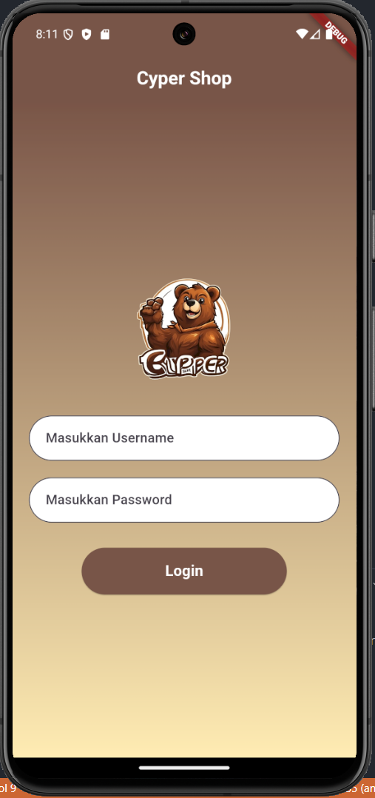
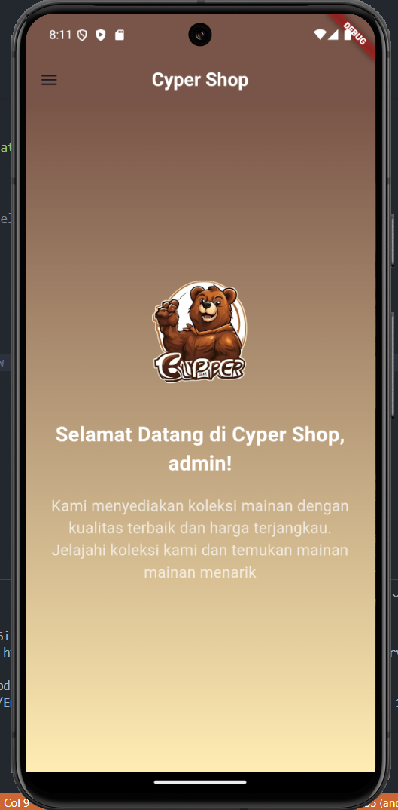
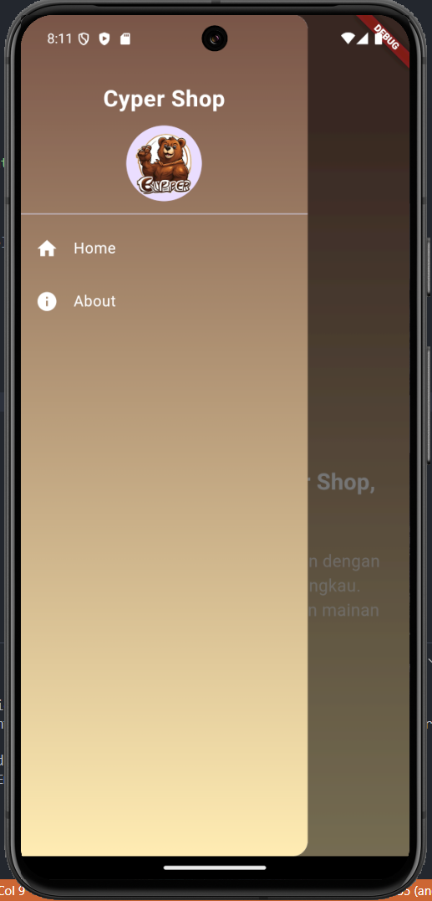
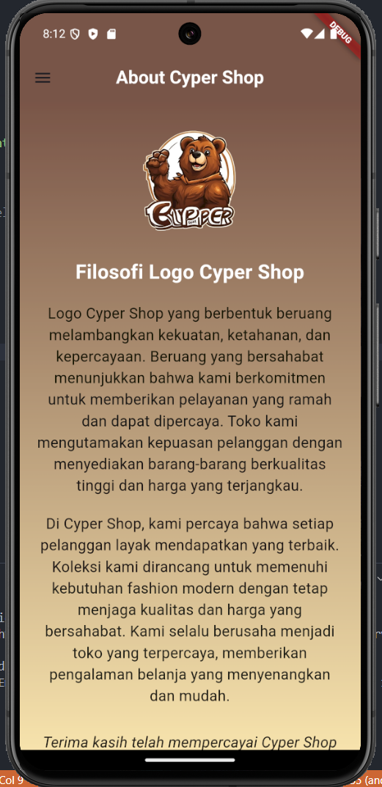

# Tugas Pertemuan 2

Nama: Azzam Dicky Umar Widadi 
NIM: H1D022090  
Shift Baru: F

## Penjelasan Program

#### 1. Main.dart
- MyApp adalah StatelessWidget yang mengatur struktur aplikasi.
- MaterialApp memiliki beranda yang ditetapkan ke LoginPage, layar pertama yang ditampilkan adalah halaman login.
```dart
    void main() {
    runApp(const MyApp());
    }

    class MyApp extends StatelessWidget {
    @override
    Widget build(BuildContext context) {
        return const MaterialApp(
        title: 'Flutter Menu',
        home: LoginPage(),
        );
     }
    }
```
#### 2. login_page.dart
- `TextEditingController` menangani input nama pengguna dan kata sandi.
- `_showInput` membuat kolom input dengan batas membulat.
- `_saveUsername()` Fungsi ini menyimpan username ke dalam SharedPreferences agar bisa digunakan di halaman lain.
- `_showDialog()` Fungsi ini menampilkan dialog untuk memberi tahu pengguna apakah login berhasil atau gagal.
```dart
    void _saveUsername() async {
        SharedPreferences prefs = await SharedPreferences.getInstance();
        prefs.setString('username', _usernameController.text);
    }

    void _showDialog(String message, Widget destination) {
        return showDialog(
            context: context,
            builder: (context) => AlertDialog(
            title: Text(message),
            actions: [
                TextButton(
                onPressed: () {
                    Navigator.push(context, MaterialPageRoute(builder: (context) => destination));
                },
                child: Text('OK'),
                )
            ],
            )
        );
    }
```

#### 3. home_page.dart
- `_loadUsername()` Fungsi yang memuat username dari SharedPreferences untuk ditampilkan di halaman home.
```dart
    void _loadUsername() async {
    SharedPreferences prefs = await SharedPreferences.getInstance();
    setState(() {
        namauser = prefs.getString('username') ?? 'Pengguna';
        });
    }
```

#### 4. sidemenu_dart
- Setiap widget `ListTile` mengarahkan pengguna ke halaman masing-masing menggunakan navigator.
```dart
    ListTile(
        leading: Icon(Icons.home, color: Colors.white),
        title: Text('Home', style: TextStyle(color: Colors.white)),
        onTap: () {
            Navigator.push(context, MaterialPageRoute(builder: (context) => HomePage()));
        },
    )
```
#### 5. about_page.dart
- Berisi konten meliputi deskripsi dan logo.
- Menampilkan filosofi dan ciri dari logo.
```dart
    Text(
        'Logo Cyper Shop yang berbentuk beruang melambangkan kekuatan, ketahanan, dan kepercayaan...',
        style: TextStyle(fontSize: 18, color: Colors.black87),
        textAlign: TextAlign.center,
    )
```
#### Cara menjalankan program
1. `flutter pub get`
2. `flutter run`

## Screenshot
1. Gambar login

2. Gambar homepage

3. Gambar sidemenu

4. Gambar about


